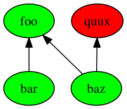

This is a project called "Grove", and an implementation of it in R called "GroveR".  The intention 
is to bring the power of [Declarative Programming](https://en.wikipedia.org/wiki/Declarative_programming)
to data-centered applications.  For example, suppose a piece of code looks like this:

```
create_foo <- function(bar, BaZzO) {
  ## create foo stuff here...
}

create_bar <- function() {
  ## create bar stuff here...
}

create_baz <- function() {
  ## create baz stuff here...
}

create_quux <- function(bazz) {
  ## create quux stuff here...
}

x <- create_bar()
BAZ <- create_baz()
result <- create_foo(x, BAZ)
```

Using the tools of `GroveR`, that can be transformed to this:

```
App <- GroveR$new()
`%auto%` <- App$auto

foo %auto% function(bar, baz) {
  ## create foo stuff here...
}

bar %auto% function() {
  ## create bar stuff here...
}

baz %auto% function() {
  ## create baz stuff here...
}

quux %auto% function(baz) {
  ## create quux stuff here...
}

## This builds any dependencies necessary to create 'foo'
result <- App$getArtifact('foo')
```

As benefits, the application now has:

 * automatic caching of intermediate artifacts
 * intelligent rebuilding of artifacts when dependencies change
 * standardized naming of data artifacts throughout the application
 * graphical tools to  (colors indicate what's up-to-date or not)
 * configurable logging of artifact creation using [futile.logger](https://cran.r-project.org/web/packages/futile.logger/index.html)
